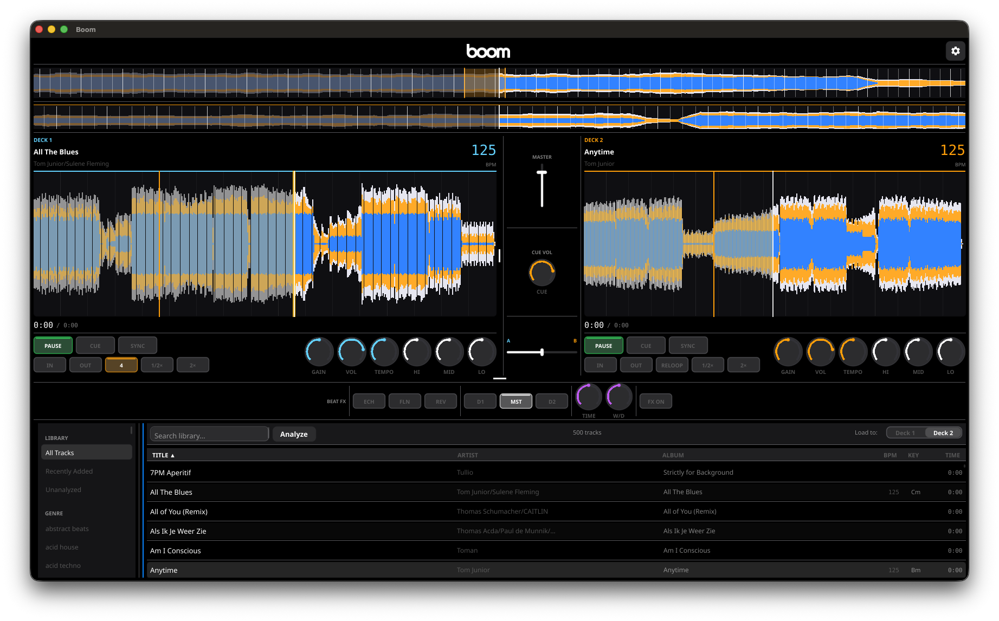

<p align="center">
  
</p>

<p align="center">
  <strong>A lightweight, cross-platform DJ performance tool written in Go.</strong>
</p>

<p align="center">
  Two decks, real-time waveforms, beat-aware loops, MIDI controller support — runs natively on macOS, Linux (including Raspberry Pi), and Windows.
</p>

<p align="center">
  
</p>

---

## Highlights

**Playback & mixing**
- Two-deck playback with sample-accurate beat loops, halve/double, and beat-grid quantization
- 3-band EQ, trim/gain, crossfader, and per-deck beat FX (echo, flanger, reverb)
- Click-free play/stop fades and soft-takeover for fader/knob pickups
- Vinyl-mode jog wheels: top-touch scratching with momentum, side pitch-bend nudges
- Optional secondary cue/headphone output on a separate audio device

**Library & analysis**
- Music library with automatic metadata scanning, backed by SQLite
- Built-in BPM and key analysis; results cached per track
- Persistent cue points and per-track tempo/loop state

**Controllers**
- YAML-based MIDI controller mappings with hot-reload
- Layered mappings (shift layers, per-deck activators), 14-bit high-res CC pairs
- LED feedback bindings for play/cue/loop state
- Interactive trainer (`midi-train`) for capturing new mappings

**Architecture**
- Event-driven core: subsystems communicate over a decoupled pub/sub bus
- Audio thread isolation: the producer goroutine never touches Go locks or allocations during playback
- Plugin interfaces for effects, analyzers, and remote library sources

## Status

Boom is under active development. The dual-deck core, mixer, library, MIDI mapping, and analyzer are functional; expect rough edges around UI polish and the plugin surface.

## Requirements

- **Go** 1.26 or newer
- **C compiler** (CGo is required for OpenGL and the audio backend)

| Platform | Additional dependencies |
|---|---|
| macOS | Xcode Command Line Tools |
| Linux | `libasound2-dev libgl1-mesa-dev xorg-dev` |
| Windows | MSYS2 or TDM-GCC |

## Quick start

```sh
# Build and run for your current platform
make run

# Or build, then launch manually
make build
./build/boom
```

On first run Boom creates `configs/boom.yaml` with sensible defaults and an empty SQLite database. Drop your music into `~/Music` (or change `music_dirs` in the settings dialog) and it'll be scanned automatically.

## Configuration

`configs/boom.yaml` is auto-generated and editable from the in-app settings dialog. Highlights:

| Setting | Purpose |
|---|---|
| `sample_rate` | Engine sample rate in Hz. Default `48000`. Tracks at other rates are resampled once on load. |
| `buffer_size` | Frames per audio block. Default `512`. Lower = lower latency, higher CPU. |
| `num_decks` | Number of decks to create. Default `2`. |
| `music_dirs` | Folders scanned for tracks. |
| `database_path` | SQLite library file location. Defaults to the OS user config dir. |
| `midi_mapping_dir` | Folder watched for controller YAML mappings. |
| `master_volume` | Initial master output gain (`0`–`1`). |
| `headphone_volume` | Initial cue/headphone output gain (`0`–`1`). |
| `audio_output_device` | Main mix output device ID. Empty = system default. |
| `cue_output_device` | Optional headphone/cue output on a second device. Empty = disabled. |
| `auto_analyze_on_deck_load` | Run BPM/key analysis when a track is loaded onto a deck. |
| `auto_analyze_on_import` | Run BPM/key analysis for every track the scanner discovers. |
| `bpm_range` | Octave-snap target for the BPM analyzer (e.g. `Normal (78–180)`). |
| `auto_cue` | Seek to the first audible sample on load instead of sample 0. |
| `loop.quantize` | Snap loop in/out points to the beat grid. |
| `loop.default_beat_loop` | Default beat length for one-tap loops. |
| `loop.min_beats` | Minimum beat length when halving (e.g. `0.03125` = 1/32). |
| `loop.max_beats` | Maximum beat length when doubling. |
| `loop.smart_loop` | Clamp loop bounds near track start/end instead of skipping. |
| `jog.vinyl_mode` | Enable top-touch scratching; side-touch always pitch-bends. |
| `jog.scratch_sensitivity` | Gain applied to scratch encoder ticks. |
| `jog.pitch_sensitivity` | Gain applied to pitch-bend encoder ticks. |
| `library.mmap_size_mb` | Cap on how much of the SQLite library may be memory-mapped. Defaults to `64`; raise to `256`+ on desktops with large libraries, lower to `16`–`32` on memory-constrained boards like Raspberry Pi 2 GB. Falls back to regular reads beyond the cap — never fails. |

## Mini-mode

Mini-mode is a compact controller-screen layout intended for a
Raspberry Pi + 5" touch screen, paired with a simple MIDI controller.
The screen shows the performance info a DJ glances at — scrolling beat
grids, deck titles and key, elapsed/remaining time, phrase counter,
full-track overview, and a per-deck peak meter — while the paired
hardware owns transport, EQ, loops, and FX.

```sh
# Dev-machine preview (800x480 simulated window)
make run-mini

# Or directly
./build/boom --mini --force-size=800x480
```

### Flags

| Flag | Effect |
|---|---|
| `--mini` | Enable the controller-screen layout. Same as `--layout=mini`. |
| `--fullscreen` | Start fullscreen. Required for a Pi kiosk. |
| `--kiosk` | Hide the settings gear and any controls that could exit the app. |
| `--force-size=WxH` | Override the window size (e.g. `800x480`, `1024x600`). |
| `--layout=desktop\|mini` | Explicit layout selection. |

Flags can also be persisted in `configs/boom.yaml` under `ui:`:

```yaml
ui:
  layout: mini
  fullscreen: true
  kiosk: true
  window_width: 800
  window_height: 480
```

### Keyboard shortcuts (no controller required)

Useful when developing or testing mini-mode without MIDI hardware:

| Key | Action |
|---|---|
| `Enter` | Open the library overlay / cycle focus between folders & tracks |
| `↑` / `↓` | Scroll the focused pane |
| `1` / `2` | Load the selected track into deck 1 / 2 (closes overlay) |
| `Escape` | Close the overlay |
| Tap play dot | Toggle play/pause for that deck |
| Tap time row | Swap elapsed ↔ remaining as the prominent reading |

### Raspberry Pi kiosk

1. Build the arm64 binary on your dev machine:

   ```sh
   make build-linux-arm64
   scp build/boom-linux-arm64 pi@raspberrypi.local:/tmp/boom
   ```

2. Install on the Pi:

   ```sh
   ssh pi@raspberrypi.local
   sudo install -m 755 /tmp/boom /usr/local/bin/boom
   sudo apt install unclutter            # hides the mouse cursor
   mkdir -p ~/.config/systemd/user
   ```

3. Copy the systemd units from `configs/systemd/` to
   `~/.config/systemd/user/` and enable them:

   ```sh
   systemctl --user daemon-reload
   systemctl --user enable --now unclutter
   systemctl --user enable --now boom-kiosk
   ```

Maintenance is SSH-only — the kiosk has no on-screen settings. To
update the binary, `scp` a new build and restart:

```sh
ssh pi@raspberrypi.local 'sudo install -m 755 /tmp/boom /usr/local/bin/boom && systemctl --user restart boom-kiosk'
```

## MIDI controllers

Mappings live in `configs/controllers/` as YAML files. The loader compiles every mapping it finds and watches the directory for changes — saving a YAML file reloads the active controller without restarting the app.

A working two-channel club-controller mapping ships in `configs/controllers/`. Use it as a reference for adding your own.

### Training a new controller

The `midi-train` utility helps you capture the MIDI messages your controller sends so you can build a mapping by example:

```sh
make midi-train
./build/midi-train
```

It walks you through each control (set min, slowly move to max, name it) and writes a JSON file describing what was captured. Hand that file to your editor — or to an LLM — to assemble a YAML mapping.

## Project layout

```
cmd/
  boom/                  Main application entry point
  midi-train/            Interactive MIDI mapping trainer
internal/
  app/                   Lifecycle wiring, action registry, LED + VU loops
  audio/                 Engine, decks, mixer, EQ, beat FX, waveform
  audio/output/          Audio backend abstraction
  analysis/              BPM and key detection
  config/                Configuration loading and defaults
  controller/            MIDI mapping compiler, dispatcher, layers, LEDs
  event/                 Pub/sub event bus
  library/               Music library, metadata scanning, SQLite store
  midi/                  MIDI device management
  plugin/                Plugin interfaces
  ui/                    Fyne UI: deck views, mixer, browser, settings
pkg/model/               Shared data types
configs/                 Default config and controller mappings
```

## Build targets

```
make build              Build for the current platform
make run                Build and run
make run-mini           Build and run in mini-mode at 800x480
make test               Run go test ./...
make lint               Run golangci-lint
make midi-train         Build the MIDI mapping trainer

make build-linux        Cross-compile for Linux amd64
make build-linux-arm64  Cross-compile for Linux arm64 (Raspberry Pi)
make build-windows      Cross-compile for Windows amd64
make build-all          Build every cross-compile target

make package-darwin-arm64   Bundle a macOS .app (Apple Silicon)
make package-darwin-amd64   Bundle a macOS .app (Intel)
make package-linux-amd64    Package a Linux build
make package-linux-arm64    Package a Linux arm64 build
make package-windows        Package a Windows build
make package-all            Package every target
```

## License

[MIT](LICENSE)
